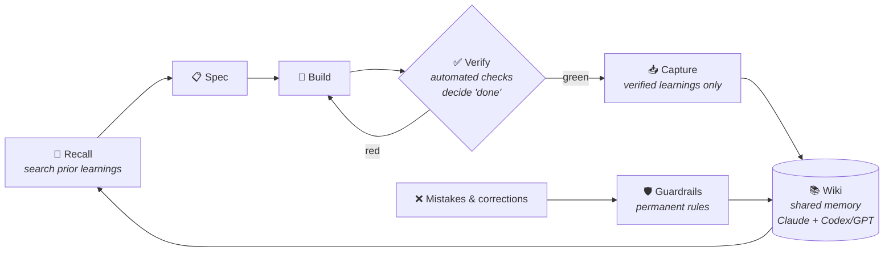

# Knowledge Memory Wiki Engine for Claude

**A shared, verified, self-improving memory for AI agents. One brain — many tools.**

## 1. The problem

Every AI agent starts every session at zero:

- Solutions get rediscovered, mistakes get repeated — every session, forever.
- Claude, Codex & Co. each hoard private notes; none of them share.
- And the worst part: typical "agent memory" is whatever the LLM writes about its own
  work — unverified, self-flattering, often wrong. **Garbage in, garbage forever.**

## 2. How it solves it

One idea: **a single markdown wiki, read by every agent, where knowledge only enters
after it has been proven to work — and every mistake leaves behind a permanent rule.**



What makes it different:

- **Verified-only memory.** The Karpathy 3-layer loop (Spec → Verifier → Environment):
  automated checks decide "done" — capture happens only **after a green verify**.
  The wiki never lies.
- **One brain, many tools.** The canonical protocol
  [`WIKI_PROTOCOL.md`](WIKI_PROTOCOL.md) is tool-neutral; `Claude.md` / `AGENTS.md` /
  `CODEX.md` are thin adapters. Claude and Codex read and write the **same** memory.
- **Typed memory, not piles of notes.** Every fact has exactly one home:
  `knowledge` (sourced facts) · `experience` (proven patterns) · `journal` (in-progress) ·
  `adr` (decisions) · `guardrails` (rules from mistakes) · `roster` (agent roles).
- **Recall before research.** A local hybrid search MCP (semantic + keyword + rank
  fusion) surfaces prior learnings *before* an agent starts working — reuse, don't rediscover.
- **Mistakes become rules.** Corrections turn into guardrails that load into every
  future session. The system provably stops repeating its errors. It memorizes the thoughtprocess.
- **A team that coaches itself.** 14 generic agent roles; retrospectives convert
  finished work and owner corrections into role, skill, and guardrail updates. More can be employed by asking claude.
  Adversarial review comes from a *different* model (GPT sparring), not self-review.

## 3. Features

- `WIKI_PROTOCOL.md` — single source of truth, tool-neutral.
- Wiki skeleton with page templates and generic example pages (replace or delete).
- **Roster of 14 generic agent roles** (canonical briefs).
- **`~/.claude` machinery** under `claude/`: agents, skills, commands, hooks.
- **Slash commands for the loop**: `/spec` (request → small verifiable spec) ·
  `/verify` (run `VERIFIER.md`, report green/red) · `/learn` (capture verified
  learnings into the wiki) · `/karpathy-init` (scaffold the 3 layers into a repo) ·
  `/wiki-review` (audit the wiki for correctness & freshness).
- **`recall-mcp/`** — vendored recall MCP server (SQLite FTS5 + FastEmbed embeddings +
  sqlite-vec + Reciprocal-Rank-Fusion). Local-first, no API key.
- **`addons/gpt-chat-mcp`** — cross-model sparring MCP (second opinion from GPT).
- **`addons/wiki-graph`** — interactive graph visualization of the wiki (very lightweighted and simple viewer infused by the idea ob Obsidian).
- **`sync.ps1` / `sync.sh`** — refresh this template from a live system:
  genericization (paths/names → placeholders) + built-in secret/leak checks.
- **projects** follow a repeatable standard approach 

## 4. Bootstrap

1. Pick a wiki location; set it wherever `<WIKI_DIR>` appears (or use this repo as the wiki).
2. Copy `claude/{agents,skills,commands,CLAUDE.md}` into your `~/.claude/` (or symlink);
   adjust paths in `claude/CLAUDE.md`.
3. Deploy recall — follow [`recall-mcp/DEPLOY.md`](recall-mcp/DEPLOY.md): bootstraps the
   venv, registers the MCP, wires the post-commit reindex hook.
4. Restart Claude Code / Codex; confirm roles + skills load and `search_notes` works.

Running live system + this template? Re-sync after machinery changes:

```
./sync.ps1 -WikiSrc <live-wiki> -RecallSrc <recall-mcp>              # Windows
WIKI_SRC=<live-wiki> RECALL_SRC=<recall-mcp> ./sync.sh               # bash
```

See [`Wiki/guardrails/machinery-sync-engine-template.md`](Wiki/guardrails/machinery-sync-engine-template.md).

## License

None — published for demonstration and reading only. All rights reserved.
